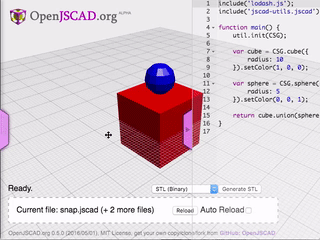
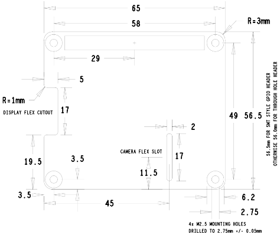
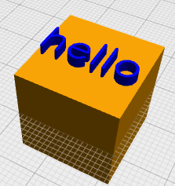
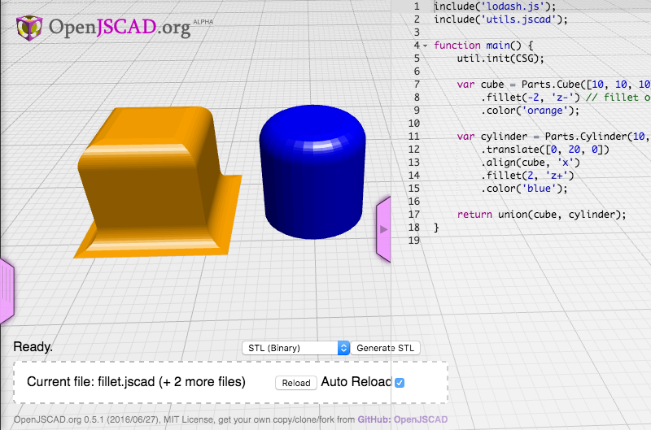
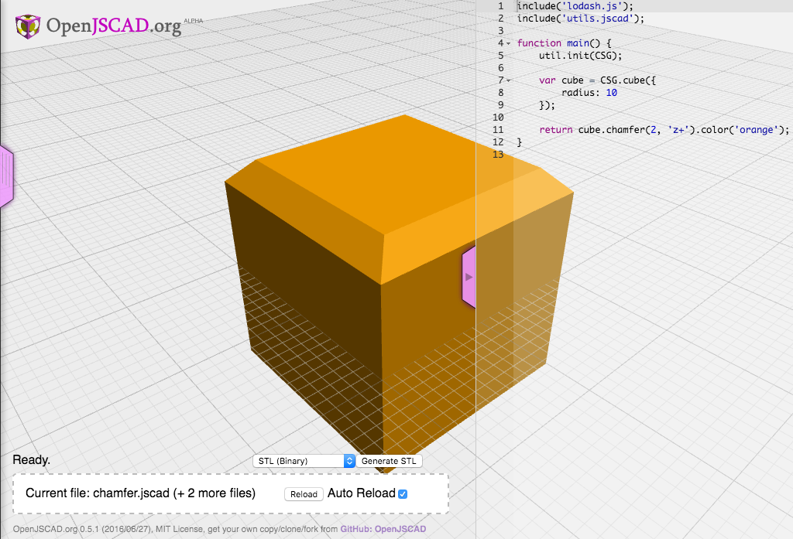
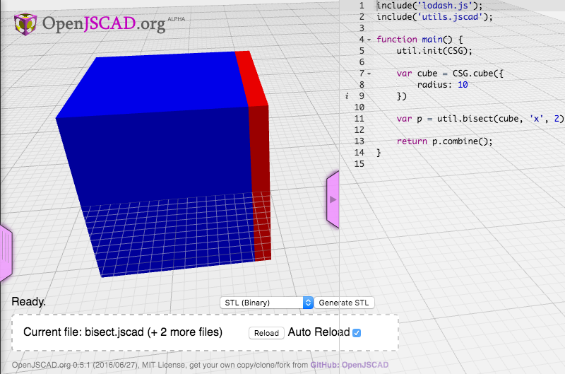
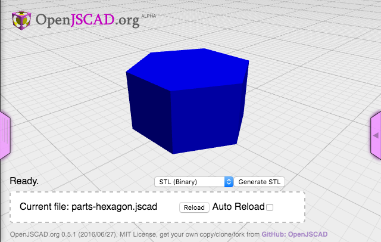
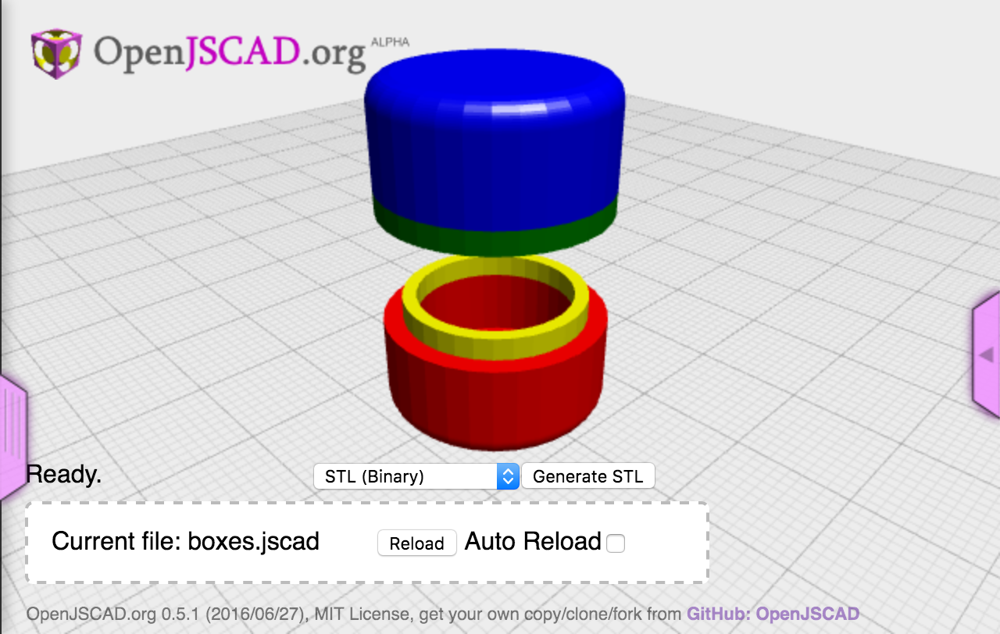
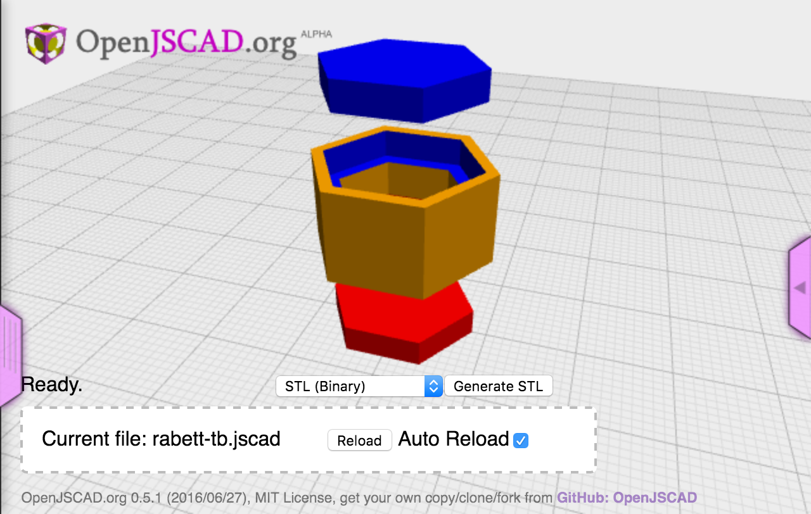

[](https://www.npmjs.org/package/jscad-utils)
[](https://www.npmjs.org/package/jscad-utils)

# jscad-utils
This is a collection of utilities for openjscad projects.  These modify the `CSG` object adding utilities for alignment, scaling and colors.  There are also some basic parts that use outside dimensions rather than radii.

For an example, see the [yeoman jscad generator](https://www.npmjs.com/package/generator-jscad) which will create a project that uses this library.

## Installation
You will need [Node.js](https://nodejs.org) version 6.4 installed.  Other versions will probobly work, but that's what it's tested with. Install `jscad-utils` using NPM:

```bash
npm install --save jscad-utils
```

## Basic usage
To use the utilities, you need to include the `jscad-utils.jscad` file and a copy of `lodash`.

```javascript
include('node_modules/jscad-utils/jscad-utils.jscad');

main() {
  util.init(CSG);

}
```

## Publishing

Use [np](https://github.com/sindresorhus/np) to publish to NPM.

## Examples
Examples are placed in the `dist` directory with the `jscad-utils.jscad` file injected into them.  This allows the files to be included directly into openjscad.org.

Here are some of the examples:

  * [snap](http://openjscad.org/#https://raw.githubusercontent.com/johnwebbcole/jscad-utils/master/dist/snap.jscad) an example showing how to use the `snap` function.
  * [bisect](http://openjscad.org/#https://raw.githubusercontent.com/johnwebbcole/jscad-utils/master/dist/bisect.jscad) an example cutting an object in two with the `bisect` function.
  * [fillet](http://openjscad.org/#https://raw.githubusercontent.com/johnwebbcole/jscad-utils/master/dist/fillet.jscad) an example adding a roundover and fillet with the `fillet` function.
  * [chamfer](http://openjscad.org/#https://raw.githubusercontent.com/johnwebbcole/jscad-utils/master/dist/chamfer.jscad) an example cutting a chamfer into an object with the `chamfer` function.

## API Reference

### Added `CSG` methods
JWC jscad utilities


* [CSG](#module_CSG)
    * [.color([red or css name], [green or alpha], [blue], [alpha])](#module_CSG.color) ⇒ <code>CSG</code>
    * [.snap(to, axis, orientation)](#module_CSG.snap) ⇒ <code>CSG</code>
    * [.midlineTo(axis, to)](#module_CSG.midlineTo) ⇒ <code>CGE</code>
    * [.align(to, axis)](#module_CSG.align) ↩︎
    * [.fit(x, y, z, a)](#module_CSG.fit) ⇒ <code>CSG</code>
    * [.size()](#module_CSG.size) ⇒ <code>CSG.Vector3D</code>
    * [.centroid()](#module_CSG.centroid) ⇒ <code>CSG.Vector3D</code>
    * [.fillet(radius, orientation, options)](#module_CSG.fillet) ⇒ <code>CSG</code>
    * [.chamfer(radius, orientation)](#module_CSG.chamfer) ⇒ <code>CSG</code>
    * [.bisect(axis, offset, angle, rotateaxis, rotateoffset)](#module_CSG.bisect) ⇒ <code>object</code>
    * [.stretch(object, axis, distance, offset)](#module_CSG.stretch) ⇒ <code>CSG</code>
    * [.unionIf(object, condition)](#module_CSG.unionIf) ⇒ <code>CSG</code>
    * [.subtractIf(object, condition)](#module_CSG.subtractIf) ⇒ <code>CSG</code>

<a name="module_CSG.color"></a>

### CSG.color([red or css name], [green or alpha], [blue], [alpha]) ⇒ <code>CSG</code>
Set the color of a CSG object using a css color name.  Also accepts the normal `setColor()` values.

**Kind**: static method of <code>[CSG](#module_CSG)</code>  
**Extends:** <code>CSG</code>  
**Chainable**  
**Returns**: <code>CSG</code> - Returns a `CSG` object set to the desired color.  

| Param | Type | Description |
| --- | --- | --- |
| [red or css name] | <code>String</code> &#124; <code>Number</code> | Css color name or the red color channel value (0.0 - 1.0) |
| [green or alpha] | <code>Number</code> | green color channel value (0.0 - 1.0) or the alpha channel when used with a css color string |
| [blue] | <code>Number</code> | blue color channel value (0.0 - 1.0) |
| [alpha] | <code>Number</code> | alpha channel value (0.0 - 1.0) |

**Example**  
```js
// creates a red cube
var redcube = CSG.cube({radius: [1, 1, 1]}).color('red');

// creates a blue cube with the alpha channel at 50%
var bluecube =  CSG.cube({radius: [1, 1, 1]}).color('blue', 0.5);

// creates a green cube with the alpha channel at 25%
// this is the same as the standard setColor
var greencube =  CSG.cube({radius: [1, 1, 1]}).color(0, 1, 0, 0.25);
```
<a name="module_CSG.snap"></a>

### CSG.snap(to, axis, orientation) ⇒ <code>CSG</code>
Snap the object to another object.  You can snap to the inside or outside
of an object.  Snapping to the `z`
axis `outside-` will place the object on top of the `to` object.  `sphere.snap(cube, 'z', 'outside-')` is saying that you want the bottom of the `sphere` (`-`) to be placed on the outside of the `z` axis of the `cube`.

Click [here](http://openjscad.org/#https://raw.githubusercontent.com/johnwebbcole/jscad-utils/master/dist/snap.jscad) for an example in openjscad.



**Kind**: static method of <code>[CSG](#module_CSG)</code>  
**Extends:** <code>CSG</code>  
**Chainable**  
**Returns**: <code>CSG</code> - [description]  

| Param | Type | Description |
| --- | --- | --- |
| to | <code>CSG</code> | object - The object to snap to. |
| axis | <code>string</code> | Which axis to snap on ['x', 'y', 'z'].  You can combine axes, ex: 'xy' |
| orientation | <code>string</code> | Which side to snap to and in what direction (+ or -). ['outside+', 'outside-', 'inside+', 'inside-', 'center+', 'center-'] |

**Example**  
```js
include('dist/utils.jscad');

// rename mainx to main
function mainx() {
   util.init(CSG);

   var cube = CSG.cube({
       radius: 10
   }).setColor(1, 0, 0);

   var sphere = CSG.sphere({
       radius: 5
   }).setColor(0, 0, 1);

   return cube.union(sphere.snap(cube, 'z', 'outside-'));
}
```
<a name="module_CSG.midlineTo"></a>

### CSG.midlineTo(axis, to) ⇒ <code>CGE</code>
Moves an objects midpoint on an axis a certain distance.  This is very useful when creating parts
from mechanical drawings.
For example, the [RaspberryPi Hat Board Specification](https://github.com/raspberrypi/hats/blob/master/hat-board-mechanical.pdf) has several pieces with the midpoint measured.

To avoid converting the midpoint to the relative position, you can use `midpointTo`.

Click [here](http://openjscad.org/#https://raw.githubusercontent.com/johnwebbcole/jscad-utils/master/dist/midlineTo.jscad) for an example in openjscad.


**Kind**: static method of <code>[CSG](#module_CSG)</code>  
**Extends:** <code>CSG</code>  
**Chainable**  
**Returns**: <code>CGE</code> - A translated CGE object.  

| Param | Type | Description |
| --- | --- | --- |
| axis | <code>String</code> | Axis to move the object along. |
| to | <code>Number</code> | The distance to move the midpoint of the object. |

**Example**  
```js
include('dist/utils.jscad');

// rename mainx to main
function mainx() {
   util.init(CSG);

   // create a RPi hat board
   var board = Parts.Board(65, 56.5, 3).color('green');

   // a 40 pin gpio
   var gpio = Parts.Cube([52.2, 5, 8.5])
       .snap(board, 'z', 'outside+')
       .midlineTo('x', 29 + 3.5)
       .midlineTo('y', 49 + 3.5)
       .color('black')

   var camera_flex_slot = Parts.Board(2, 17, 1)
       .midlineTo('x', 45)
       .midlineTo('y', 11.5)
       .color('red');

   // This is more group, due to the outside 1mm          * roundover.
   // Create a board to work from first.  The spec
   // has the edge offset, not the midline listed as          * 19.5mm.
   // Bisect the cutout into two parts.
   var display_flex_cutout = Parts.Board(5, 17, 1)
       .translate([0, 19.5, 0])
       .bisect('x');

   // Bisect the outside (negative) part.
   var edges = display_flex_cutout.parts.negative.bisect('y');

   // Create a cube, and align it with the rounded edges
   // of the edge, subtract the edge from it and move it
   // to the other side of the coutout.
   var round1 = Parts.Cube([2, 2, 2])
       .snap(edges.parts.positive, 'xyz', 'inside-')
       .subtract(edges.parts.positive)
       .translate([0, 17, 0]);

   // Repeat for the opposite corner
   var round2 = Parts.Cube([2, 2, 2])
       .snap(edges.parts.negative, 'yz', 'inside+')
       .snap(edges.parts.negative, 'x', 'inside-')
       .subtract(edges.parts.negative)
       .translate([0, -17, 0]);

   // Create a cube cutout so the outside is square instead of rounded.
   // The `round1` and `round2` parts will be used to subtract off the rounded outside corner.
   var cutout = Parts.Cube(display_flex_cutout.parts.negative.size()).align(display_flex_cutout.parts.negative, 'xyz');

   return board
       .union(gpio)
       .subtract(camera_flex_slot)
       .subtract(union([display_flex_cutout.parts.positive,
           cutout
       ]))
       .subtract(round1)
       .subtract(round2);
}
```
<a name="module_CSG.align"></a>

### CSG.align(to, axis) ↩︎
Align with another object on the selected axis.

**Kind**: static method of <code>[CSG](#module_CSG)</code>  
**Extends:** <code>CSG</code>  
**Chainable**  

| Param | Type | Description |
| --- | --- | --- |
| to | <code>CSG</code> | The object to align to. |
| axis | <code>string</code> | A string indicating which axis to align, 'x', 'y', 'z', or any combination including 'xyz'. |

<a name="module_CSG.fit"></a>

### CSG.fit(x, y, z, a) ⇒ <code>CSG</code>
Fit an object inside a bounding box. Often
used to fit text on the face of an object.
 A zero for a size value will leave that axis untouched.

Click [here](http://openjscad.org/#https://raw.githubusercontent.com/johnwebbcole/jscad-utils/master/dist/fit.jscad) for an example in openjscad.



**Kind**: static method of <code>[CSG](#module_CSG)</code>  
**Extends:** <code>CSG</code>  
**Returns**: <code>CSG</code> - The new object fitted inside a bounding box  

| Param | Type | Description |
| --- | --- | --- |
| x | <code>number</code> &#124; <code>array</code> | size of x or array of axes |
| y | <code>number</code> &#124; <code>boolean</code> | size of y axis or a boolean too keep the aspect ratio if `x` is an array |
| z | <code>number</code> | size of z axis |
| a | <code>boolean</code> | Keep objects aspect ratio |

**Example**  
```js
include('dist/utils.jscad');

// rename mainx to main
function mainx() {
   util.init(CSG);

   var cube = CSG.cube({
       radius: 10
   }).color('orange');

   // create a label, place it on top of the cube
   // and center it on the top face
   var label = util.label('hello')
       .snap(cube, 'z', 'outside-')
       .align(cube, 'xy');

   var s = cube.size();
   // fit the label to the cube (minus 2mm) while
   // keeping the aspect ratio of the text
   // and return the union
   return cube.union(label.fit([s.x - 2, s.y - 2, 0], true).color('blue'));
}
```
<a name="module_CSG.size"></a>

### CSG.size() ⇒ <code>CSG.Vector3D</code>
Returns the size of the object in a `Vector3D` object.

**Kind**: static method of <code>[CSG](#module_CSG)</code>  
**Extends:** <code>CSG</code>  
**Returns**: <code>CSG.Vector3D</code> - A `CSG.Vector3D` with the size of the object.  
**Example**  
```js
var cube = CSG.cube({
    radius: 10
}).setColor(1, 0, 0);

var size = cube.size()

// size = {"x":20,"y":20,"z":20}
```
<a name="module_CSG.centroid"></a>

### CSG.centroid() ⇒ <code>CSG.Vector3D</code>
Returns the centroid of the current objects bounding box.

**Kind**: static method of <code>[CSG](#module_CSG)</code>  
**Extends:** <code>CSG</code>  
**Returns**: <code>CSG.Vector3D</code> - A `CSG.Vector3D` with the center of the object bounds.  
<a name="module_CSG.fillet"></a>

### CSG.fillet(radius, orientation, options) ⇒ <code>CSG</code>
Add a fillet or roundover to an object.

Click [here](http://openjscad.org/#https://raw.githubusercontent.com/johnwebbcole/jscad-utils/master/dist/fillet.jscad) for an example in openjscad.



**Kind**: static method of <code>[CSG](#module_CSG)</code>  
**Extends:** <code>CSG</code>  
**Chainable**  
**Returns**: <code>CSG</code> - [description]  

| Param | Type | Description |
| --- | --- | --- |
| radius | <code>number</code> | Radius of fillet.  Positive and negative radius will create a fillet or a roundover. |
| orientation | <code>string</code> | Axis and end (positive or negative) to place the chamfer.  Currently on the `z` axis is supported. |
| options | <code>object</code> | additional options. |

**Example**  
```js
include('dist/utils.jscad');

// rename mainx to main
function mainx() {
util.init(CSG);

var cube = Parts.Cube([10, 10, 10]);

return cube
  .fillet(2, 'z+') // roundover on top (positive fillet)
  .fillet(-2, 'z-') // fillet on  the bottom (negative fillet)
  .color('orange');
}
```
<a name="module_CSG.chamfer"></a>

### CSG.chamfer(radius, orientation) ⇒ <code>CSG</code>
Add a chamfer to an object.  This modifies the object by removing part of the object and reducing its size over the radius of the chamfer.

Click [here](http://openjscad.org/#https://raw.githubusercontent.com/johnwebbcole/jscad-utils/master/dist/chamfer.jscad) for an example in openjscad.



**Kind**: static method of <code>[CSG](#module_CSG)</code>  
**Extends:** <code>CSG</code>  
**Chainable**  
**Returns**: <code>CSG</code> - [description]  

| Param | Type | Description |
| --- | --- | --- |
| radius | <code>number</code> | Radius of the chamfer |
| orientation | <code>string</code> | Axis and end (positive or negative) to place the chamfer.  Currently on the `z` axis is supported. |

**Example**  
```js
include('dist/utils.jscad');

// rename mainx to main
function mainx() {
util.init(CSG);

var cube = CSG.cube({
    radius: 10
});

return cube.chamfer(2, 'z+').color('orange');
}
```
<a name="module_CSG.bisect"></a>

### CSG.bisect(axis, offset, angle, rotateaxis, rotateoffset) ⇒ <code>object</code>
Cuts an object into two parts.  You can modify the offset, otherwise two equal parts are created.  The `group` part returned has a `positive` and `negative` half, cut along the desired axis.

Click [here](http://openjscad.org/#https://raw.githubusercontent.com/johnwebbcole/jscad-utils/master/dist/bisect.jscad) for an example in openjscad.



**Kind**: static method of <code>[CSG](#module_CSG)</code>  
**Extends:** <code>CSG</code>  
**Returns**: <code>object</code> - A group group object with a parts dictionary and a `combine()` method.  

| Param | Type | Description |
| --- | --- | --- |
| axis | <code>string</code> | Axis to cut the object |
| offset | <code>number</code> | Offset to cut the object.  Defaults to the middle of the object |
| angle | <code>number</code> | angle to rotate the cut plane to |
| rotateaxis | <code>number</code> | axis to rotate the cut plane around. |
| rotateoffset | <code>number</code> | offset in the rotateaxis for the rotation point of the cut plane. |

<a name="module_CSG.stretch"></a>

### CSG.stretch(object, axis, distance, offset) ⇒ <code>CSG</code>
Wraps the `stretchAtPlane` call using the same
logic as `bisect`. This cuts the object at the plane,
and stretches the cross-section there by distance
amount.  The plane is located at the center of the
axis unless an `offset` is given, then it is the
offset from either end of the axis.

**Kind**: static method of <code>[CSG](#module_CSG)</code>  
**Extends:** <code>CSG</code>  
**Returns**: <code>CSG</code> - The stretched object.  

| Param | Type | Description |
| --- | --- | --- |
| object | <code>CSG</code> | Object to stretch |
| axis | <code>String</code> | Axis to streatch along |
| distance | <code>Number</code> | Distance to stretch |
| offset | <code>Number</code> | Offset along the axis to cut the object |

<a name="module_CSG.unionIf"></a>

### CSG.unionIf(object, condition) ⇒ <code>CSG</code>
Union only if the condition is true, otherwise the original object is returned.  You can pass in a function that returns a `CSG` object that only gets evaluated if the condition is true.

**Kind**: static method of <code>[CSG](#module_CSG)</code>  
**Extends:** <code>CSG</code>  
**Returns**: <code>CSG</code> - The resulting object.  

| Param | Type | Description |
| --- | --- | --- |
| object | <code>CSG</code> &#124; <code>function</code> | A CSG object to union with, or a function that reutrns a CSG object. |
| condition | <code>boolean</code> | boolean value to determin if the object should perform the union. |

<a name="module_CSG.subtractIf"></a>

### CSG.subtractIf(object, condition) ⇒ <code>CSG</code>
Subtract only if the condition is true, otherwise the original object is returned.  You can pass in a function that returns a `CSG` object that only gets evaluated if the condition is true.

**Kind**: static method of <code>[CSG](#module_CSG)</code>  
**Extends:** <code>CSG</code>  
**Returns**: <code>CSG</code> - The resulting object.  

| Param | Type | Description |
| --- | --- | --- |
| object | <code>CSG</code> &#124; <code>function</code> | A CSG object to union with, or a function that reutrns a CSG object. |
| condition | <code>boolean</code> | boolean value to determin if the object should perform the subtraction. |


### util
jscad-utils


* [util](#module_util) : <code>Object</code>
    * [.identity(solid)](#module_util.identity) ⇒ <code>object</code>
    * [.result(object, f)](#module_util.result) ⇒ <code>object</code>
    * [.defaults(target, defaults)](#module_util.defaults) ⇒ <code>object</code>
    * [.print(msg, o)](#module_util.print)
    * [.inch(x)](#module_util.inch) ⇒ <code>Number</code>
    * [.cm(x)](#module_util.cm) ⇒ <code>Number</code>
    * [.segment(object, segments, axis)](#module_util.segment) ⇒ <code>Array</code>
    * [.map(o, f)](#module_util.map) ⇒ <code>array</code>
    * [.size(o)](#module_util.size) ⇒ <code>CSG.Vector3D</code>
    * [.scale(size, value)](#module_util.scale) ⇒ <code>number</code>
    * [.enlarge(object, x, y, z, [options])](#module_util.enlarge) ⇒ <code>CSG</code>
    * [.fit(object, x, y, z, keep_aspect_ratio)](#module_util.fit) ⇒ <code>CSG</code>
    * [.flush(moveobj, withobj, axis, mside, wside)](#module_util.flush) ⇒ <code>CSG</code>
    * [.group(names, objects)](#module_util.group) ⇒ <code>object</code>
    * [.getDelta(size, bounds, axis, offset, nonzero)](#module_util.getDelta) ⇒ <code>Point</code>
    * [.bisect(object, axis, offset, angle)](#module_util.bisect) ⇒ <code>object</code>
    * [.stretch(object, axis, distance, offset)](#module_util.stretch) ⇒ <code>CSG</code>
    * [.poly2solid(top, bottom, height)](#module_util.poly2solid) ⇒ <code>CSG</code>
    * [.init(CSG)](#module_util.init) ⇐ <code>CSG</code>

<a name="module_util.identity"></a>

### util.identity(solid) ⇒ <code>object</code>
A function that reutrns the first argument.  Useful when
passing in a callback to modify something, and you want a
default functiont hat does nothing.

**Kind**: static method of <code>[util](#module_util)</code>  
**Returns**: <code>object</code> - the first parameter passed into the function.  

| Param | Type | Description |
| --- | --- | --- |
| solid | <code>object</code> | an object that will be returned |

<a name="module_util.result"></a>

### util.result(object, f) ⇒ <code>object</code>
If `f` is a funciton, it is executed with `object` as the parameter.  This is used in
`CSG.unionIf` and `CSG.subtractIf`, allowing you to pass a function instead of an object.  Since the
function isn't exeuted until called, the object to `union` or `subtract` can be assembled only if
the conditional is true.

**Kind**: static method of <code>[util](#module_util)</code>  
**Returns**: <code>object</code> - the result of the function or the object.  

| Param | Type | Description |
| --- | --- | --- |
| object | <code>object</code> | the context to run the function with. |
| f | <code>function</code> &#124; <code>object</code> | if a funciton it is executed, othewise the object is returned. |

<a name="module_util.defaults"></a>

### util.defaults(target, defaults) ⇒ <code>object</code>
Returns target object with default values assigned. If values already exist, they are not set.

**Kind**: static method of <code>[util](#module_util)</code>  
**Returns**: <code>object</code> - Target object with default values assigned.  

| Param | Type | Description |
| --- | --- | --- |
| target | <code>object</code> | The target object to return. |
| defaults | <code>object</code> | Defalut values to add to the object if they don't already exist. |

<a name="module_util.print"></a>

### util.print(msg, o)
Print a message and CSG object bounds and size to the conosle.

**Kind**: static method of <code>[util](#module_util)</code>  

| Param | Type | Description |
| --- | --- | --- |
| msg | <code>String</code> | Message to print |
| o | <code>CSG</code> | A CSG object to print the bounds and size of. |

<a name="module_util.inch"></a>

### util.inch(x) ⇒ <code>Number</code>
Convert an imperial `inch` to metric `mm`.

**Kind**: static method of <code>[util](#module_util)</code>  
**Returns**: <code>Number</code> - Result in mm  

| Param | Type | Description |
| --- | --- | --- |
| x | <code>Number</code> | Value in inches |

<a name="module_util.cm"></a>

### util.cm(x) ⇒ <code>Number</code>
Convert metric `cm` to imperial `inch`.

**Kind**: static method of <code>[util](#module_util)</code>  
**Returns**: <code>Number</code> - Result in inches  

| Param | Type | Description |
| --- | --- | --- |
| x | <code>Number</code> | Value in cm |

<a name="module_util.segment"></a>

### util.segment(object, segments, axis) ⇒ <code>Array</code>
Returns an array of positions along an object on a given axis.

**Kind**: static method of <code>[util](#module_util)</code>  
**Returns**: <code>Array</code> - An array of segment positions.  

| Param | Type | Description |
| --- | --- | --- |
| object | <code>CSG</code> | The object to calculate the segments on. |
| segments | <code>number</code> | The number of segments to create. |
| axis | <code>string</code> | Axis to create the sgements on. |

<a name="module_util.map"></a>

### util.map(o, f) ⇒ <code>array</code>
Object map function, returns an array of the object mapped into an array.

**Kind**: static method of <code>[util](#module_util)</code>  
**Returns**: <code>array</code> - an array of the mapped object.  

| Param | Type | Description |
| --- | --- | --- |
| o | <code>object</code> | Object to map |
| f | <code>function</code> | function to apply on each key |

<a name="module_util.size"></a>

### util.size(o) ⇒ <code>CSG.Vector3D</code>
Returns a `Vector3D` with the size of the object.

**Kind**: static method of <code>[util](#module_util)</code>  
**Returns**: <code>CSG.Vector3D</code> - Vector3d with the size of the object  

| Param | Type | Description |
| --- | --- | --- |
| o | <code>CSG</code> | A `CSG` like object or an array of `CSG.Vector3D` objects (the result of getBounds()). |

<a name="module_util.scale"></a>

### util.scale(size, value) ⇒ <code>number</code>
Returns a scale factor (0.0-1.0) for an object
that will resize it by a value in size units instead
of percentages.

**Kind**: static method of <code>[util](#module_util)</code>  
**Returns**: <code>number</code> - Scale factor  

| Param | Type | Description |
| --- | --- | --- |
| size | <code>number</code> | Object size |
| value | <code>number</code> | Amount to add (negative values subtract) from the size of the object. |

<a name="module_util.enlarge"></a>

### util.enlarge(object, x, y, z, [options]) ⇒ <code>CSG</code>
Enlarge an object by scale units, while keeping the same
centroid.  For example util.enlarge(o, 1, 1, 1) enlarges
object o by 1mm in each access, while the centroid stays the same.

**Kind**: static method of <code>[util](#module_util)</code>  
**Returns**: <code>CSG</code> - [description]  

| Param | Type | Default | Description |
| --- | --- | --- | --- |
| object | <code>CSG</code> |  | [description] |
| x | <code>number</code> |  | [description] |
| y | <code>number</code> |  | [description] |
| z | <code>number</code> |  | [description] |
| [options] | <code>Object</code> | <code>{ centroid:     true }</code> | [description] |

<a name="module_util.fit"></a>

### util.fit(object, x, y, z, keep_aspect_ratio) ⇒ <code>CSG</code>
Fit an object inside a bounding box.  Often used
with text labels.

**Kind**: static method of <code>[util](#module_util)</code>  
**Returns**: <code>CSG</code> - [description]  

| Param | Type | Description |
| --- | --- | --- |
| object | <code>CSG</code> | [description] |
| x | <code>number</code> &#124; <code>array</code> | [description] |
| y | <code>number</code> | [description] |
| z | <code>number</code> | [description] |
| keep_aspect_ratio | <code>boolean</code> | [description] |

<a name="module_util.flush"></a>

### util.flush(moveobj, withobj, axis, mside, wside) ⇒ <code>CSG</code>
Moves an object flush with another object

**Kind**: static method of <code>[util](#module_util)</code>  
**Returns**: <code>CSG</code> - [description]  

| Param | Type | Description |
| --- | --- | --- |
| moveobj | <code>CSG</code> | Object to move |
| withobj | <code>CSG</code> | Object to make flush with |
| axis | <code>String</code> | Which axis: 'x', 'y', 'z' |
| mside | <code>Number</code> | 0 or 1 |
| wside | <code>Number</code> | 0 or 1 |

<a name="module_util.group"></a>

### util.group(names, objects) ⇒ <code>object</code>
Creates a `group` object given a comma separated
list of names, and an array or object.  If an object
is given, then the names list is used as the default
parts used when the `combine()` function is called.

You can call the `combine()` function with a list of parts you want combined into one.

The `map()` funciton allows you to modify each part
contained in the group object.

**Kind**: static method of <code>[util](#module_util)</code>  
**Returns**: <code>object</code> - An object that has a parts dictionary, a `combine()` and `map()` function.  

| Param | Type | Description |
| --- | --- | --- |
| names | <code>string</code> | Comma separated list of part names. |
| objects | <code>array</code> &#124; <code>object</code> | Array or object of parts.  If Array, the names list is used as names for each part. |

<a name="module_util.getDelta"></a>

### util.getDelta(size, bounds, axis, offset, nonzero) ⇒ <code>Point</code>
Given an size, bounds and an axis, a Point
along the axis will be returned.  If no `offset`
is given, then the midway point on the axis is returned.
When the `offset` is positive, a point `offset` from the
mininum axis is returned.  When the `offset` is negative,
the `offset` is subtracted from the axis maximum.

**Kind**: static method of <code>[util](#module_util)</code>  
**Returns**: <code>Point</code> - The point along the axis.  

| Param | Type | Description |
| --- | --- | --- |
| size | <code>Size</code> | Size array of the object |
| bounds | <code>Bounds</code> | Bounds of the object |
| axis | <code>String</code> | Axis to find the point on |
| offset | <code>Number</code> | Offset from either end |
| nonzero | <code>Boolean</code> | When true, no offset values under 1e-4 are allowed. |

<a name="module_util.bisect"></a>

### util.bisect(object, axis, offset, angle) ⇒ <code>object</code>
Cut an object into two pieces, along a given axis. The offset
allows you to move the cut plane along the cut axis.  For example,
a 10mm cube with an offset of 2, will create a 2mm side and an 8mm side.

Negative offsets operate off of the larger side of the axes.  In the previous example, an offset of -2 creates a 8mm side and a 2mm side.

You can angle the cut plane and poistion the rotation point.


**Kind**: static method of <code>[util](#module_util)</code>  
**Returns**: <code>object</code> - Returns a group object with a parts object.  

| Param | Type | Description |
| --- | --- | --- |
| object | <code>CSG</code> | object to bisect |
| axis | <code>string</code> | axis to cut along |
| offset | <code>number</code> | offset to cut at |
| angle | <code>number</code> | angle to rotate the cut plane to |

<a name="module_util.stretch"></a>

### util.stretch(object, axis, distance, offset) ⇒ <code>CSG</code>
Wraps the `stretchAtPlane` call using the same
logic as `bisect`.

**Kind**: static method of <code>[util](#module_util)</code>  
**Returns**: <code>CSG</code> - The stretched object.  

| Param | Type | Description |
| --- | --- | --- |
| object | <code>CSG</code> | Object to stretch |
| axis | <code>String</code> | Axis to stretch along |
| distance | <code>Number</code> | Distance to stretch |
| offset | <code>Number</code> | Offset along the axis to cut the object |

<a name="module_util.poly2solid"></a>

### util.poly2solid(top, bottom, height) ⇒ <code>CSG</code>
Takes two CSG polygons and createds a solid of `height`.
Similar to `CSG.extrude`, excdept you can resize either
polygon.

**Kind**: static method of <code>[util](#module_util)</code>  
**Returns**: <code>CSG</code> - generated solid  

| Param | Type | Description |
| --- | --- | --- |
| top | <code>CAG</code> | Top polygon |
| bottom | <code>CAG</code> | Bottom polygon |
| height | <code>number</code> | heigth of solid |

<a name="module_util.init"></a>

### util.init(CSG) ⇐ <code>CSG</code>
Initialize `jscad-utils` and add utilities to the `CSG` object.

**Kind**: static method of <code>[util](#module_util)</code>  
**Extends:** <code>CSG</code>  

| Param | Type | Description |
| --- | --- | --- |
| CSG | <code>CSG</code> | The global `CSG` object |


### Colors
Color utilities for jscad.  Makes setting colors easier using css color names.  Using `.init()` adds a `.color()` function to the CSG object.
> You must use `Colors.init(CSG)` in the `main()` function.  The `CSG` class is not available before this.

**Example**  
```js
include('jscad-utils-color.jscad');

function mainx(params) {
  Colors.init(CSG);

  // draws a purple cube
  return CSG.cube({radius: [10, 10, 10]}).color('purple');
}
```
<a name="module_jscad-utils-color.init"></a>

### jscad-utils-color.init(CSG) ⇐ <code>CSG</code>
Initialize the Color utility.  This adds a `.color()` prototype to the `CSG` object.

**Kind**: static method of <code>[jscad-utils-color](#module_jscad-utils-color)</code>  
**Extends:** <code>CSG</code>  

| Param | Type | Description |
| --- | --- | --- |
| CSG | <code>CSG</code> | The global `CSG` object |


### Parts
A collection of parts for use in jscad.  Requires jscad-utils.


**Example**  
```js
include('jscad-utils-color.jscad');

function mainx(params) {
  util.init(CSG);

  // draws a blue hexagon
  return Parts.Hexagon(10, 5).color('blue');
}
```

### Boxes
jscad box and join utilities.  This should be considered experimental,
but there are some usefull utilities here.



**Example**  
```js
include('dist/jscad-utils.jscad');

function mainx(params) {
    util.init(CSG);

    var cyl = Parts.Cylinder(20, 20)
    var cbox = Boxes.Hollow(cyl, 3, function (box) {
      return box
          .fillet(2, 'z+')
          .fillet(2, 'z-');
    });
    var box = Boxes.Rabett(cbox, 3, 0.5, 11, 2)
    return box.parts.top.translate([0, 0, 10]).union(box.parts.bottom);
}
```

* [Boxes](#module_Boxes) : <code>Object</code>
    * [.Rabett(box, thickness, gap, height, face)](#module_Boxes.Rabett) ⇒ <code>group</code>
    * [.RabettTopBottom(box, thickness, gap, options)](#module_Boxes.RabettTopBottom) ⇒ <code>group</code>
    * [.Hollow(object, thickness, interiorcb)](#module_Boxes.Hollow) ⇒ <code>CSG</code>
    * [.BBox(o)](#module_Boxes.BBox) ⇒ <code>CSG</code>

<a name="module_Boxes.Rabett"></a>

### Boxes.Rabett(box, thickness, gap, height, face) ⇒ <code>group</code>
This will bisect an object using a rabett join.  Returns a
`group` object with `positive` and `negative` parts.

**Kind**: static method of <code>[Boxes](#module_Boxes)</code>  
**Returns**: <code>group</code> - A group object with `positive`, `negative` parts.  

| Param | Type | Description |
| --- | --- | --- |
| box | <code>CSG</code> | The object to bisect. |
| thickness | <code>Number</code> | Thickness of the objects walls. |
| gap | <code>Number</code> | Gap between the join cheeks. |
| height | <code>Number</code> | Offset from the bottom to bisect the object at.  Negative numbers offset from the top. |
| face | <code>Number</code> | Size of the join face. |

<a name="module_Boxes.RabettTopBottom"></a>

### Boxes.RabettTopBottom(box, thickness, gap, options) ⇒ <code>group</code>
Used on a hollow object, this will rabett out the top and/or
bottom of the object.



**Kind**: static method of <code>[Boxes](#module_Boxes)</code>  
**Returns**: <code>group</code> - An A hollow version of the original object..  

| Param | Type | Description |
| --- | --- | --- |
| box | <code>CSG</code> | A hollow object. |
| thickness | <code>Number</code> | The thickness of the object walls |
| gap | <code>Number</code> | The gap between the top/bottom and the walls. |
| options | <code>Object</code> | Options to have a `removableTop` or `removableBottom`.  Both default to `true`. |
| options.removableTop | <code>Boolean</code> | The top will be removable. |
| options.removableBottom | <code>Boolean</code> | The bottom will be removable. |

**Example**  
```js
include('dist/jscad-utils.jscad');

function mainx(params) {
    util.init(CSG);
    var part = Parts.Hexagon(20, 10).color('orange');
    var cbox = Boxes.Hollow(part, 3);

    var box = Boxes.RabettTopBottom(cbox, 3, 0.25);


    return union([
        box.parts.top.translate([0, 0, 20]),
        box.parts.middle.translate([0, 0, 10]),
        box.parts.bottom
    ]);
}
```
<a name="module_Boxes.Hollow"></a>

### Boxes.Hollow(object, thickness, interiorcb) ⇒ <code>CSG</code>
Takes a solid object and returns a hollow version with a selected
wall thickness.  This is done by reducing the object by half the
thickness and subtracting the reduced version from the original object.


**Kind**: static method of <code>[Boxes](#module_Boxes)</code>  
**Returns**: <code>CSG</code> - An A hollow version of the original object..  

| Param | Type | Description |
| --- | --- | --- |
| object | <code>CSG</code> | A CSG object |
| thickness | <code>Number</code> | The thickness of the walls. |
| interiorcb | <code>function</code> | A callback that allows processing the object before returning. * @param {Function} exteriorcb        A callback that allows processing the object before returning. |

<a name="module_Boxes.BBox"></a>

### Boxes.BBox(o) ⇒ <code>CSG</code>
Create a box that surounds the object.

**Kind**: static method of <code>[Boxes](#module_Boxes)</code>  
**Returns**: <code>CSG</code> - The bounding box aligned with the object.  

| Param | Type | Description |
| --- | --- | --- |
| o | <code>CSG</code> | The object to create a bounding box for. |


&copy; 2016 John Cole <johnwebbcole@gmail.com>. Documented by [jsdoc-to-markdown](https://github.com/75lb/jsdoc-to-markdown).
