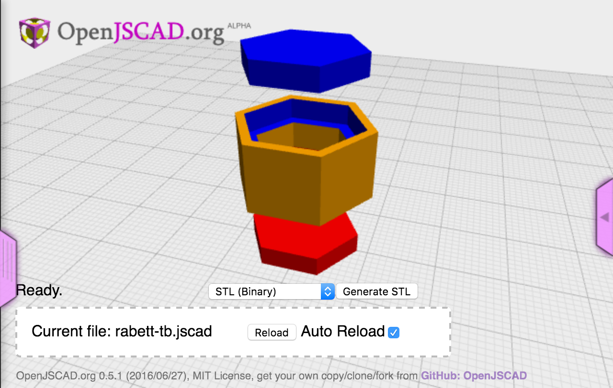

[](https://www.npmjs.org/package/jscad-utils)
[](https://www.npmjs.org/package/jscad-utils)


[](https://www.npmjs.org/package/@jwc/jscad-utils)
[](https://www.npmjs.org/package/@jwc/jscad-utils)


# jscad-utils

This is a collection of utilities for openjscad projects. These modify the `CSG` object adding utilities for alignment,
scaling and colors. There are also some basic parts that use outside dimensions rather than radii.

For an example, see the [yeoman jscad generator](https://www.npmjs.com/package/generator-jscad) which will create a
project that uses this library.

## Version 4

I'm currently updating `jscad-utils` to work with the new JsCad v2. The code base has moved to ES6, built with Rollup
and has some unit tests. There is a v1 compatibility file for continued use with JsCad 1.9.x. The examples work with the
compatiblity shim and 1.9.

I still need to get the documentation to build again and upgrade the other libraries and yeoman generator.

This new version is scoped in npm under `@jwc/jscad-utils`.

### Upgrading

You need to remove the previous version and then install the new one.

```
npm remove jscad-utils
npm install @jwc/jscad-utils
```

If you are using a recent yoeman generated project, it should pick up the new version. If you are using any of the other
jscad-\* libraries, be careful, they are having issues until I update them to ES6, stick to the v3 untill they are
updated.

## Installation

You will need [Node.js](https://nodejs.org) version 6.4 installed. Other versions will probobly work, but that's what
it's tested with. Install `jscad-utils` using NPM:

```bash
npm install --save jscad-utils
```

## Basic usage

To use the utilities, you need to include the `jscad-utils.jscad`.

```javascript
include('node_modules/jscad-utils/jscad-utils.jscad');

main() {
util.init(CSG);

}
```

## Publishing

Use [np](https://github.com/sindresorhus/np) to publish to NPM.

## Examples

Examples are placed in the `dist` directory with the `jscad-utils.jscad` file injected into them. This allows the files to be included directly into openjscad.org.

Here are some of the examples:

- [snap](http://openjscad.org/#https://gitlab.com/johnwebbcole/jscad-utils/raw/master/dist/examples/snap.jscad) an example showing how to use the `snap` function.
- [bisect](http://openjscad.org/#https://gitlab.com/johnwebbcole/jscad-utils/raw/master/dist/examples/bisect.jscad) an example cutting an object in two with the `bisect` function.
- [fillet](http://openjscad.org/#https://gitlab.com/johnwebbcole/jscad-utils/raw/master/dist/examples/fillet.jscad) an example adding a roundover and fillet with the `fillet` function.
- [chamfer](http://openjscad.org/#https://gitlab.com/johnwebbcole/jscad-utils/raw/master/dist/examples/chamfer.jscad) an example cutting a chamfer into an object with the `chamfer` function.
- [boxes](http://openjscad.org/#https://gitlab.com/johnwebbcole/jscad-utils/raw/master/dist/examples/boxes.jscad)
- [fit](http://openjscad.org/#https://gitlab.com/johnwebbcole/jscad-utils/raw/master/dist/examples/fit.jscad)
- [midlineTo](http://openjscad.org/#https://gitlab.com/johnwebbcole/jscad-utils/raw/master/dist/examples/midlineTo.jscad)
- [parts-hexagon](http://openjscad.org/#https://gitlab.com/johnwebbcole/jscad-utils/raw/master/dist/examples/parts-hexagon.jscad)
- [rabett-tb](http://openjscad.org/#https://gitlab.com/johnwebbcole/jscad-utils/raw/master/dist/examples/rabett-tb.jscad)
- [retraction-test](http://openjscad.org/#https://gitlab.com/johnwebbcole/jscad-utils/raw/master/dist/examples/retraction-test.jscad)
- [size](http://openjscad.org/#https://gitlab.com/johnwebbcole/jscad-utils/raw/master/dist/examples/size.jscad)
- [text](http://openjscad.org/#https://gitlab.com/johnwebbcole/jscad-utils/raw/master/dist/examples/text.jscad)
